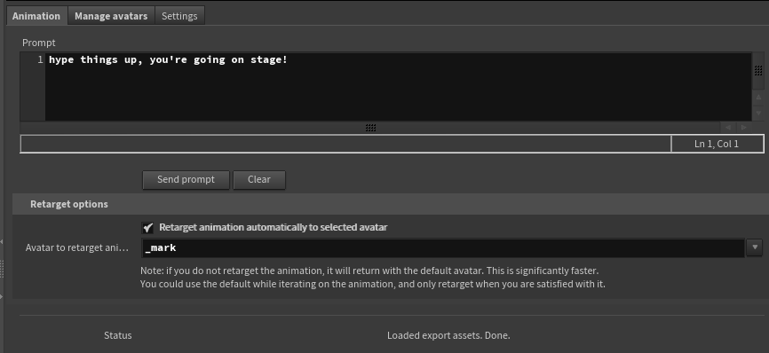
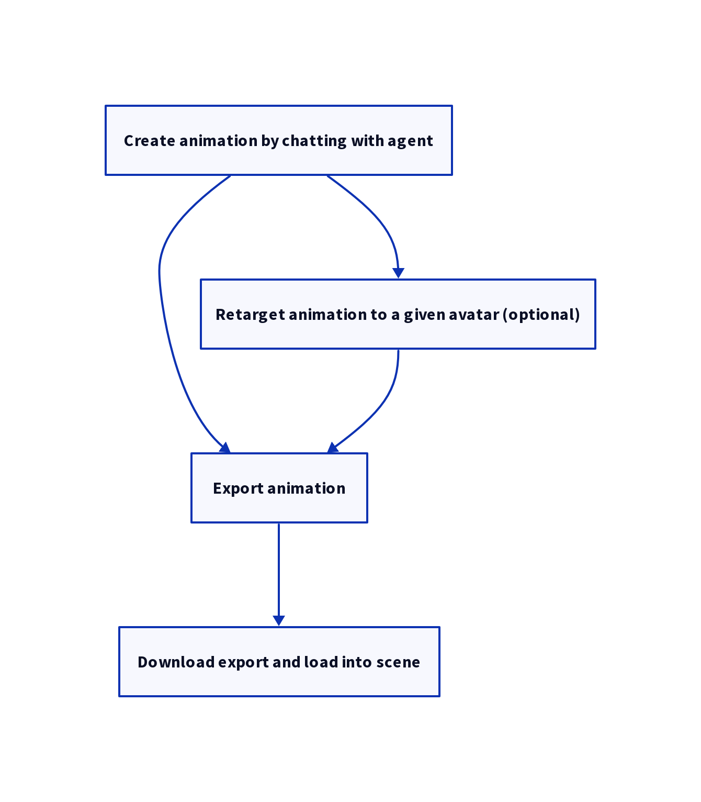

# Cairos Houdini user client

Use [Cairos](https://cairos.ai) inside Houdini

## Installing
Make sure to have a system Python that is compatible with the Houdini Python. For Houdini 20.5 this is Python 3.11. This can also be achieved with uv or anaconda. E.g. for uv:
``` shell
uv venv --python 3.11
```

Clone the repo, then get the dependencies
``` shell
git submodule update --init
```

### With the provided installation scripts
These scripts should cover most regular use cases.

Linux:
```
./install.sh
```

Windows:
```
./install.ps1
```

The script will prompt you for the location to copy the plugin to, the location of Houdini, the location of a virtual environment, containing some needed dependencies.

### Manually
The installation scripts may not cover your setup, or they may fail. In this case running things manually step by step might be clearer.

#### Windows
Open up powershell. If you are going to write in Program Files, select "Run as Administrator".

First define the target locations. These paths are defaults, replace them to your preference.
They will be referenced in subsequent commands.
You can create variables like here, or you could directly paste the path in place of the variable in the commands below.

``` powershell
$plugin_dest = "c:\Program Files\Common Files\Houdini\cairos-houdini-user-client"
$houdini_path = "c:\Program Files\Houdini20.5.510"
$venv_path = Join-Path -Path $env:LocalAppData -ChildPath "\cairos\venvs\cairos"
$package_dest = "c:\Program Files\Houdini20.5.510\packages\cairos_user.json"
```

##### Copy the plugin from the cloned directory to your system
``` powershell
cp -Path ".\*" -Destination $plugin_dest -Recurse
```

Note, this is optional. If you wish to use the plugin straight from the cloned location, replace `$plugin_dest` in the next section with the cloned location.

##### Copy the Houdini json package file to Houdini's directory.
This command will copy the file and automatically replace the location placeholders:
``` powershell
Get-Content ./cairos_inst_windows.json | ForEach-Object {$_ -replace "{{ plugin_dest }}", $plugin_dest}| ForEach-Object {$_ -replace "{{ venv_path }}", $venv_path} | ForEach-Object {$_ -replace "\\", "/"} | Set-Content $package_dest
```

Alternatively, you can copy the package yourself and replace the placeholders in a text editor:

* Copy `cairos_inst_windows.json` to `$package_dest`
* Open the file and
  * Replace `{{ venv_path }}` with the path to the virtual environment specified above.
  * Replace `{{ plugin_dest }}` with the location where you copied the plugin.
  * Replace backslashes (`\`) with forward slashes (`/`)

##### Create a Python virtual environment and install the dependencies
###### Using the built-in Python venv module
Create:
`python -m venv $venv_path`

Activate:
`$venv_path/Scripts/activate.ps1`

Install modules (with environment activated):
`pip install -r ./requirements.txt`

###### Using [Astral uv](https://docs.astral.sh/uv/)
Create:
`uv venv --python 3.11 $venv_path`

Activate:
`$venv_path/Scripts/activate.ps1`

Install modules:
`uv pip install -r ./requirements.txt`

###### Using [Anaconda](https://docs.conda.io/projects/conda/en/latest/index.html)
*Note:* the Anaconda environment may break some of Houdini's dependencies, and not work.

Create with the provided environment yml:
`conda env create -f cairos_conda.yml`

Activate:
`conda activate cairos`

Find out venv path, insert it in the Houdini json package:

* Execute `conda info` and look for "active env location". By default this is `c:\ProgramData\anaconda3\envs\cairos`.
* In `cairos_user.json` that you copied to the Houdini packages directory, replace `{{ venv_path }}` with the env location (will require administrator rights). Replace backslashes in the json file with forward slashes.
* This will tell Houdini where to find the Python library dependencies.

#### Linux
Specify destination paths. These paths are defaults, replace them to your preference.
They will be referenced in subsequent commands.
``` sh
plugin_dest=/opt/houdini_plugins/cairos-houdini-user-client
houdini_path=/opt/hfs20.5.510
venv_path=/usr/local/share/cairos/venvs/cairos
package_dest=/opt/hfs20.5.510/packages/cairos_user.json
```
##### Copy the plugin from the cloned directory to your system

##### Copy package file
Either copy the package file using this command:
``` sh
sed -e "s@{{ plugin_dest }}@${plugin_dest}@g" -e "s@{{ venv_path }}@${venv_path}@g" ./cairos_inst.json | tee ${package_dest}
```
or straight up copying and replacing the placeholders:

* Copy `cairos_inst.json` to `$package_dest`
* Open the file and
  * Replace `{{ venv_path }}` with the path to the virtual environment specified above.
  * Replace `{{ plugin_dest }}` with the location where you copied the plugin.

##### Create a Python virtual environment and install the dependencies
###### Using the built-in Python venv module
Create:
`python -m venv $venv_path`

Activate:
`source $venv_path/bin/activate`

Install modules (with environment activated):
`pip install -r ./requirements.txt`

###### Using [Astral uv](https://docs.astral.sh/uv/)
Create:
`uv venv --python 3.11 $venv_path`

Activate:
`source $venv_path/bin/activate`

Install modules:
`uv pip install -r ./requirements.txt`

## Using the Cairos plugin



In Houdini, you can add a Geometry node `Cairos Houdini user client`.

Go to the Settings tab and click login. Enter the Cairos address you will be using, your username and password. The public address is https://app.cairos.ai/api

To sign up, go to https://cairos.ai .

On successful login, you can go to the Animation tab and submit chat prompts, and manage your avatars in the Avatar tab.

## Workflow

### Animating



You start with an animation, that you obtain by chatting with the agent and getting suggested movements.

This animation uses a default avatar, which is processed fast. This permits iterating to refine the animation with further prompts.

Once the sequence is completed, it is exported, downloaded locally, and loaded in Houdini.

### Managing avatars
You can upload, autorig, export, and delete avatars from the HDA.

You can select an existing avatar from the list, or enter the name for a new one in "Character name", then upload you selected geometry from "Character skin SOP" to it.

When uploading or autorigging a character, it is automatically exported, downloaded locally, and loaded in Houdini.
